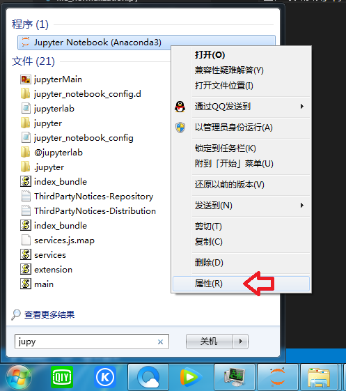

# 南方科技大学商学院评价项目

本文档介绍 altmetric.com\plumx\dimensions数据的下载。

## 所需工具

代码基于python语言，主要工具为jupyter。

### Anaconda

Anaconda是一个python集成环境，预安装了很多常用的python包，包括jupyter。网址 https://www.anaconda.com/， 直接下载安装（直接下一步就可），打开后得到如下界面：

### jupyter

如上图所示，jupyter已经通过anaconda安装。jupyter是一个类笔记本式python运行环境，可以运行ipynb后缀文件，详细内容可参考其官网：https://jupyter.org/。

jupyter启动后可以通过浏览器访问地址 http://localhost:8888/tree/ 进入（初始端口为8888，若被占用，可能为8889或者其它）。jupyter的起始目录一般为C盘根目录，如果需要切换至其它盘，如E盘，可以修改jupyter程序属性：

 

其运行界面如下：

点开ipynb文档后，运行界面如下：

## 文章数据下载

目前下载主要为三方数据：altmetric.com、plumx、dimensions, mendeley，下载的单元为article（文章）。现在代码里下载数据为2014-2018年大概5000多本期刊（ABS：1074， WOS：3890）的所有文章。主要步骤如下：

1. 通过dimensions平台下载所有期刊5年的所有文章基本信息，包括doi，标题，作者等信息。其中doi信息为后续下载其它数据的关键。

2. 通过文章的doi，获取此文章在altmetric.com、plumx、elsevier平台的平台id，此平台id为后续下载平台数据的键值。

3. 通过altmetric id下载altmetric.com的详细页面数据，包括'news outlets', 'blogs', 'policy', 'tweeters', 'weibo', 'facebook pages', 'wikipedia', 'redditors', 'f1000', 'video uploader', 'dimensions_citation', 'mendeley', 'citeulike'。

4. 通过plumx id下载plumx平台的详细数据，包括'abstruct_views', 'full_text_views', 'link_click_count', 'link_outs', 'exports_saves', 'reader_count_mendeley', 'reader_count_citeulike', 'cited_by_count_scopus', 'cited_by_count_crossref', 'cited_by_count_pubmed', 'tweets', 'facebook', 'news', 'blogs', 'reference_count_wikipedia', 'comment_count_reddit', 'mention_qa_site_mentions'。

5. 通过文章eid下载mendeley的views和citations数据。

### dimensions数据下载

代码在grab_dimensions2.ipynb下。

### altmetric.com数据下载

代码在grab_altmetric_dot_com2.ipynb下。

### plumX数据下载

代码在grab_plumx2.ipynb下。

### mendeley数据下载

代码在grab_elsevier.ipynb下。

## 学校信息下载

学校信息主要为全国高校名称、高校录取分数线以及高校满意度评分。高校名称和满意度评分来源于学信网阳光高考（https://gaokao.chsi.com.cn/），高校录取分数线来源于高考网（http://college.gaokao.com/）