# Twitter 和 Facebook数据一致性比较

## OR

OR没有Plos数据，以下分析均为altmetric.com和Plumx平台对比。

### Kolmogorov-Smirnov检验

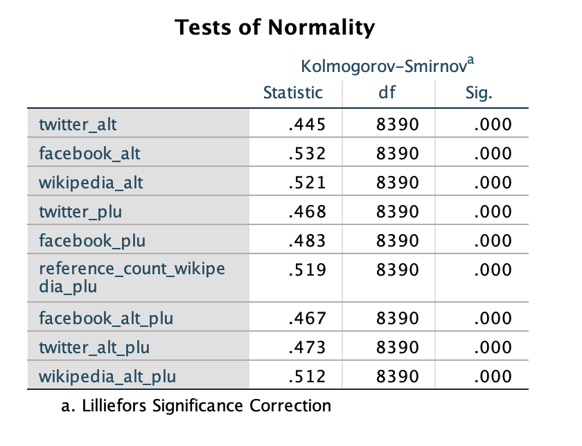

从正态性检验来看，altmetric.com和Plumx的数据均不服从正态分布。

### Facebook

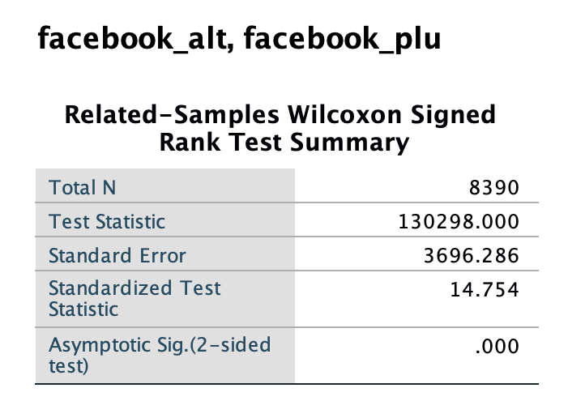

altmetric.com和Plumx的facebook数据中值存在显著差异。

### Twitter

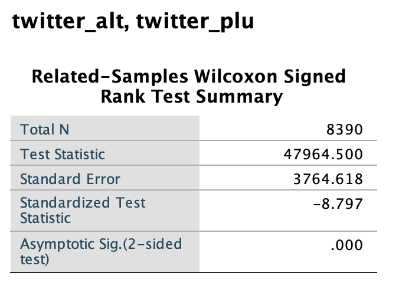

altmetric.com和Plumx的twitter数据中值存在显著差异。

## Management

Management没有Plos数据，以下分析均为altmetric.com和Plumx平台对比。

### Kolmogorov-Smirnov检验

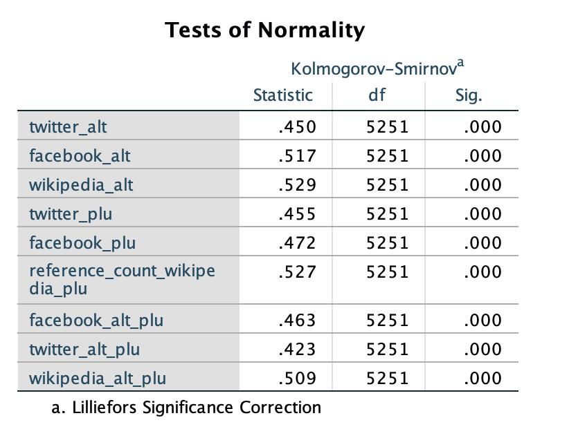

从正态性检验来看，altmetric.com和Plumx的数据均不服从正态分布。

### Facebook

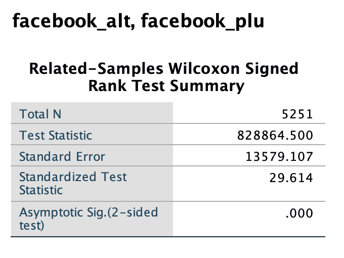

altmetric.com和Plumx的facebook数据中值存在显著差异。

### Twitter

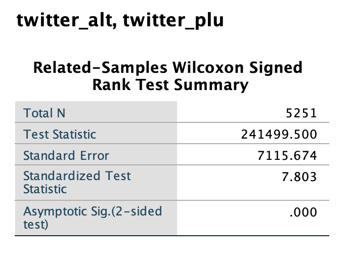

altmetric.com和Plumx的twitter数据中值存在显著差异。

### Wikipedia

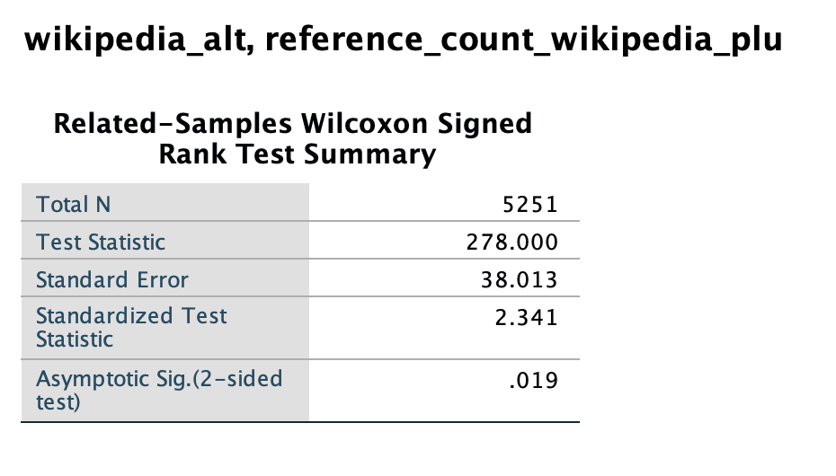

altmetric.com和Plumx的Wikipedia数据中值存在显著差异。

## Plos

以下分析均为altmetric.com\Plumx\Plos平台对比。由于Plos暂停了facebook数据的更新，以下只对twitter和Wikipedia数据进行分析。

### Kolmogorov-Smirnov检验

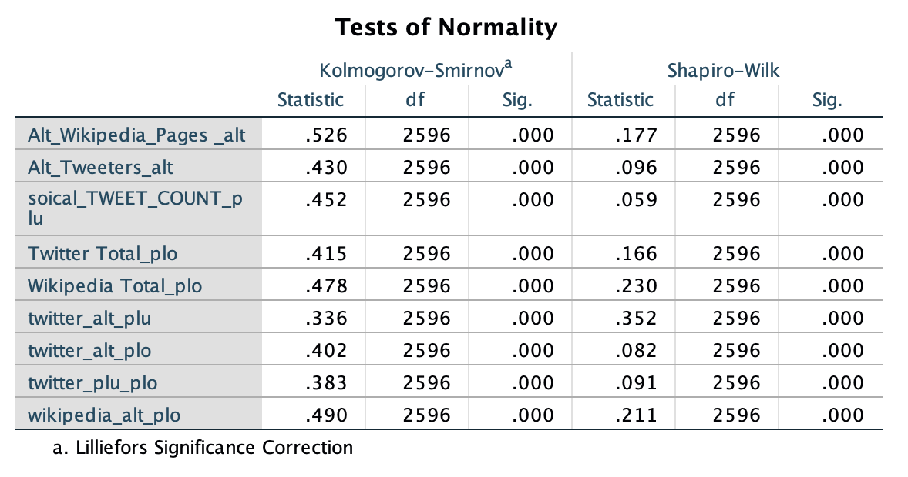

从正态性检验来看，altmetric.com、Plumx和Plos的数据均不服从正态分布。

### Twitter

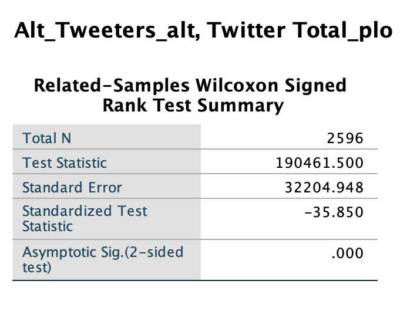
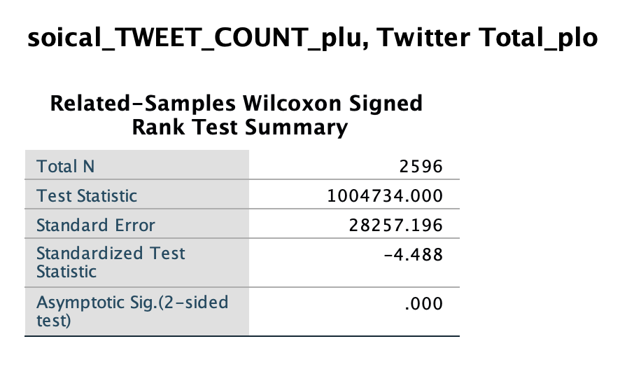

altmetric.com、Plumx和Plos的twitter数据中值存在显著差异。

### Wikipedia

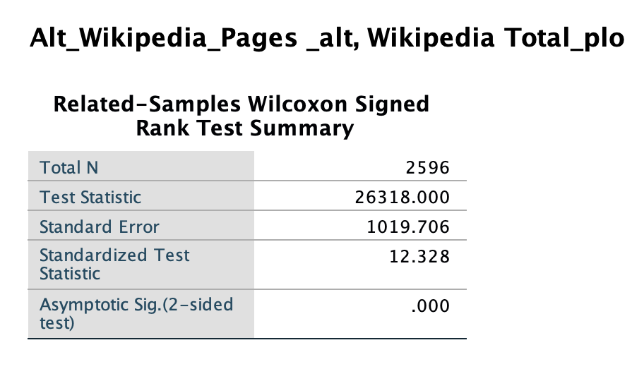

altmetric.com和Plos的Wikipedia数据中值存在显著差异。